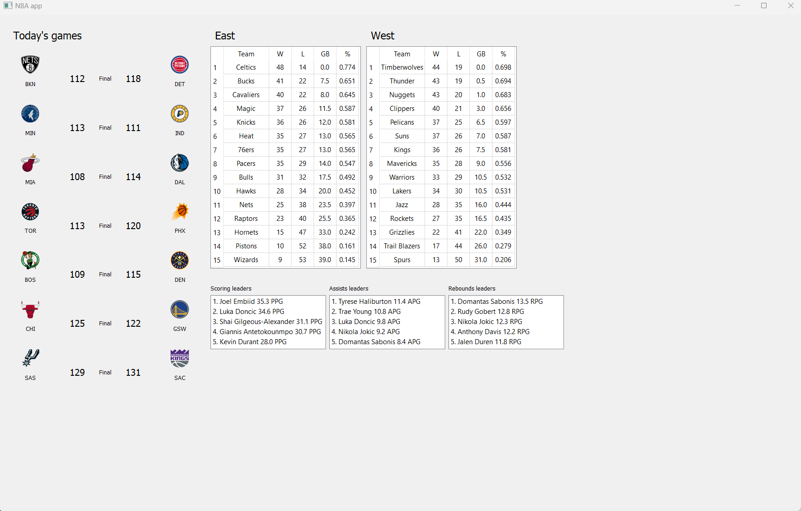

# NBA APP

This project provides real-time data about NBA games and team standings. It utilizes the NBA API to fetch live information and displays it through a graphical user interface.

## Table of Contents

- [NBA APP](#nba-app)
  - [Table of Contents](#table-of-contents)
  - [Introduction](#introduction)
  - [Installation](#installation)
  - [Usage](#usage)
  - [Project structure](#project-structure)
  - [Dependencies](#dependencies)
  - [Screenshot](#screenshot)
  - [License](#license)

## Introduction

This Python project offers real-time updates on NBA games and team standings. The graphical user interface provides an interactive way to stay informed about live NBA action.

## Installation

To set up the project, follow these steps:
1. Clone the project repository.
2. Navigate to the project directory.
3. Install the required dependencies using the following command:
   ```bash
   pip install -r requirements.txt
   ```
4. Run the main script:

   ```bash
   python main.py
   ```

## Usage

Once the project is installed, you can run the main script to launch the graphical user interface. The interface will provide real-time information about ongoing NBA games and current team standings.

```bash
python main.py
```

## Project structure

The project is structured into the following main components:

- main.py: The entry point of the application.
- model: Contains classes for handling game data, team information, and updating real-time scores and standings.
- controller: Includes the Controller class, which acts as an intermediary between the view and model.
- view: Houses the graphical user interface components, implemented using PyQt5.

## Dependencies

Ensure you have the following dependencies installed

- [PyQt5](https://pypi.org/project/PyQt5/#:~:text=PyQt5%205.15.10&text=PyQt5%20is%20a%20comprehensive%20set,platforms%20including%20iOS%20and%20Android.)
- [nba-api](https://github.com/swar/nba_api)

Install them using the following command:

```bash
pip install -r requirements.txt
```

Python version : 3.12

## Screenshot



## License

MIT License

Copyright (c) 2024 SamuArg

Permission is hereby granted, free of charge, to any person obtaining a copy
of this software and associated documentation files (the "Software"), to deal
in the Software without restriction, including without limitation the rights
to use, copy, modify, merge, publish, distribute, sublicense, and/or sell
copies of the Software, and to permit persons to whom the Software is
furnished to do so, subject to the following conditions:

The above copyright notice and this permission notice shall be included in all
copies or substantial portions of the Software.

THE SOFTWARE IS PROVIDED "AS IS", WITHOUT WARRANTY OF ANY KIND, EXPRESS OR
IMPLIED, INCLUDING BUT NOT LIMITED TO THE WARRANTIES OF MERCHANTABILITY,
FITNESS FOR A PARTICULAR PURPOSE AND NONINFRINGEMENT. IN NO EVENT SHALL THE
AUTHORS OR COPYRIGHT HOLDERS BE LIABLE FOR ANY CLAIM, DAMAGES OR OTHER
LIABILITY, WHETHER IN AN ACTION OF CONTRACT, TORT OR OTHERWISE, ARISING FROM,
OUT OF OR IN CONNECTION WITH THE SOFTWARE OR THE USE OR OTHER DEALINGS IN THE
SOFTWARE.
